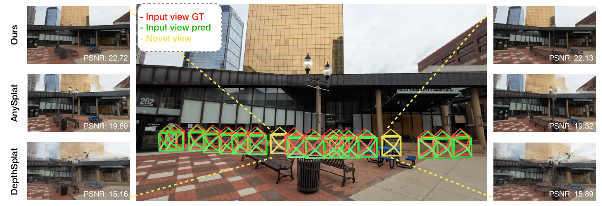

<div align="center">
  <h1>LVSPM: Long Sequence View Synthesis and Pose Estimation Model</h1>
  <h3>ECCV 2026</h3>
  <p><a href="https://burningdust21.github.io/">Xi Chen</a>, <a href="https://openreview.net/profile?id=~Yachi_Zhang1">Yachi Zhang</a>, <a href="https://ootts.github.io/">Linghao Chen</a>, <a href="https://cseweb.ucsd.edu/~mil070/">Minghua Liu</a>, <a href="https://www.haosu.ai/">Hao Su</a>, <a href="https://zexiangxu.github.io/">Zexiang Xu</a>, <a href="https://jetd.one/">Xiaoshuai Zhang</a></p>
  <p><a href="https://burningdust21.github.io/Projects/LVSPM/">Project Page</a> | <a href="https://huggingface.co/spaces/LittleFrog/LVSPM">Demo</a> | <a href="https://arxiv.org/abs/2610.10960">Paper</a> | <a href="https://drive.google.com/file/d/18WZf1M4pp2bcEgx1iSau8SfTMo6Czxbt/view?usp=sharing">Supplementary Material</a></p>
</div>

Official code release for **LVSPM: Long Sequence View Synthesis and Pose Estimation Model**.



## Installation

Install the environment:

```bash
conda create -n lvspm python=3.10 -y
conda activate lvspm
python -m pip install -r requirements.txt
conda install -c conda-forge ffmpeg -y
```

## Model Zoo

Download the checkpoints from [Hugging Face](https://huggingface.co/LittleFrog/lvspm/tree/main)
and place them in `checkpoints/`.

| Checkpoint | Input resolution (W×H) | Weights |
| --- | --- | --- |
| `LVSPM_512x288.ckpt` | 512×288 | [Download](https://huggingface.co/LittleFrog/lvspm/resolve/main/LVSPM_512x288.ckpt) |
| `LVSPM_448x256.ckpt` | 448×256 | [Download](https://huggingface.co/LittleFrog/lvspm/resolve/main/LVSPM_448x256.ckpt) |

## Quick Start

Place RGB images of one scene in a folder, then predict cameras and
render a novel path. JPEG, PNG, BMP, and WebP are supported.

Run the included 64-image library demo, or use your own image folder:

```bash
python -m src.infer_folder \
  --checkpoint checkpoints/LVSPM_512x288.ckpt \
  --image-dir assets/demo \
  --num-input-views 64 \
  --output-dir output/demo
```

Outputs include a novel-view video, camera poses, and a GLB camera visualization.
The command also reports prefill latency and cached-render FPS.

For more options, run `python -m src.infer_folder --help`.

## Evaluation

Install the dataset download tool and sign in:

```bash
python -m pip install -U huggingface_hub
hf auth login
```

### Evaluate DL3DV Pose

Download [DL3DV-Evaluation](https://huggingface.co/datasets/DL3DV/DL3DV-Evaluation),
prepare the data, and run pose evaluation:

```bash
hf download DL3DV/DL3DV-Evaluation --repo-type dataset \
  --include 'images_tar/*.tar' --local-dir data/raw/DL3DV-Evaluation

python scripts/prepare_dl3dv.py --preset dl3dv_pose \
  --input-root data/raw/DL3DV-Evaluation --output-root data/DL3DV-Evaluation

CUDA_VISIBLE_DEVICES=0 python -m src.main mode=test \
  +evaluation=lvspm_equal_temporal evaluation.preset=dl3dv_pose evaluation.views=16
```

The converter reads the downloaded scene archives directly and creates scene
ZIPs and `test.json`.

### Evaluate DL3DV NVS

Download [DL3DV-Benchmark](https://huggingface.co/datasets/DL3DV/DL3DV-Benchmark),
prepare the data, and run novel-view synthesis evaluation:

```bash
hf download DL3DV/DL3DV-Benchmark --repo-type dataset \
  --include '*/nerfstudio/transforms.json' '*/nerfstudio/images_4/*' \
  --local-dir data/raw/DL3DV-140

python scripts/prepare_dl3dv.py --preset dl3dv_nvs \
  --input-root data/raw/DL3DV-140 --output-root data/DL3DV-ALL-960P

CUDA_VISIBLE_DEVICES=0 python -m src.main mode=test \
  +evaluation=lvspm_equal_temporal evaluation.preset=dl3dv_nvs evaluation.views=16
```

Use the benchmark's `images_4` images. The converter packages all 140 scenes
into ZIPs and writes `test.json`.

The context and target indices are in `assets/evaluation/dl3dv_pose/<views>.json`
and `assets/evaluation/dl3dv_nvs/<views>.json`.
Set `evaluation.views` to a supported view count; checkpoints and input
resolutions are selected automatically.

| Preset | Context views | Input resolution (W×H) |
| --- | --- | --- |
| `dl3dv_pose` | 16, 32, 64, 128, 256 | 512×288 |
| `dl3dv_nvs` | 16, 64, 128, 256 | 448×256 |

For comparison with baselines, pose is evaluated at 512×288 and NVS at 448×256.

For custom data, checkpoint, and output locations:

```bash
CUDA_VISIBLE_DEVICES=0 python -m src.main mode=test \
  +evaluation=lvspm_equal_temporal evaluation.preset=dl3dv_pose evaluation.views=16 \
  evaluation.dataset_root=/path/to/DL3DV-Evaluation \
  checkpointing.load=/path/to/LVSPM_512x288.ckpt \
  test.output_path=output/dl3dv_pose_view16
```

Results are saved in `<test.output_path>/lvspm/`, with per-scene
`metrics_pose.json` or `metrics.json` and aggregate `scores_protocol_avg.json`.
Pose evaluation reports AUC@3, AUC@5, and AUC@30; NVS reports PSNR, SSIM, and
LPIPS. Scores are averaged across scenes.

To evaluate one setting on eight GPUs:

```bash
NUM_NODE=1 CUDA_VISIBLE_DEVICES=0,1,2,3,4,5,6,7 python -m src.main mode=test \
  +evaluation=lvspm_equal_temporal evaluation.preset=dl3dv_pose evaluation.views=16 \
  test.output_path=output/dl3dv_pose_view16
```

To schedule all supported evaluation settings across eight GPUs:

```bash
python -m src.misc.run_evaluation_matrix \
  --gpus 0,1,2,3,4,5,6,7 \
  --output-root output/equitemporal
```

## Training

Brewing..

## Acknowledgements

Thanks to these great repositories: [MVSplat](https://github.com/donydchen/mvsplat),
[LVSM](https://github.com/Haian-Jin/LVSM), [LaCT](https://github.com/a1600012888/LaCT),
and many other inspiring open-source projects.

## Citation

```bibtex
@inproceedings{chen2026lvspm,
  title={{LVSPM}: Long Sequence View Synthesis and Pose Estimation Model},
  author={Chen, Xi and Zhang, Yachi and Chen, Linghao and Liu, Minghua and Su, Hao and Xu, Zexiang and Zhang, Xiaoshuai},
  booktitle={European Conference on Computer Vision (ECCV)},
  year={2026}
}
```
